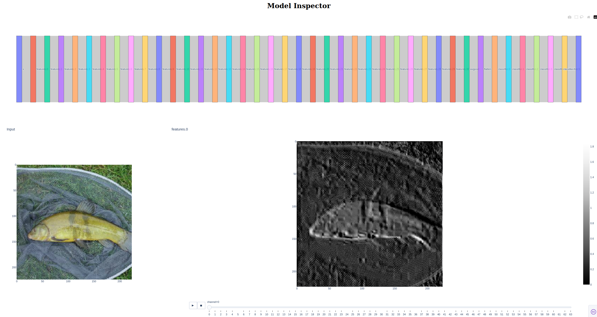
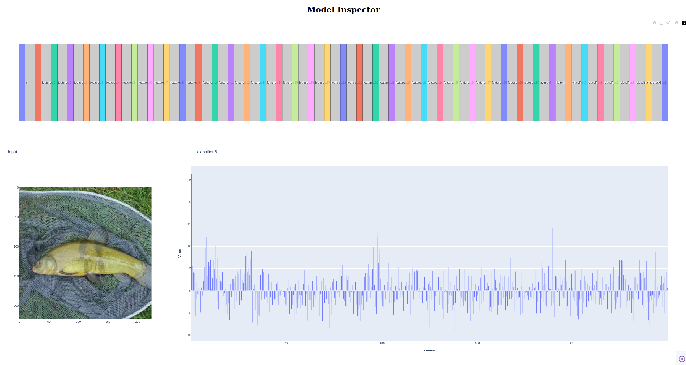

# Model Inpector

This repo contains a tool to visualize your models and all the hidden layers.  
You can inspect the feature maps and all the layers output in real time.

## Quickstart

There are 2 ways of using this tool, from your program or as CLI.

### Using python
```commandline
import modelinspector

model = ...
x = ... # 1 element batched tensor

inspector = modelinspector.ModelInspector(model, x)

inspector.run() 
```

You will then open your browser (normally at 127.0.0.1:8050 unless changed config).


### CLI
```commandline
python -mmodelinspector <path_to_model> <path_to_saved_tensor>
```

## Screenshots


